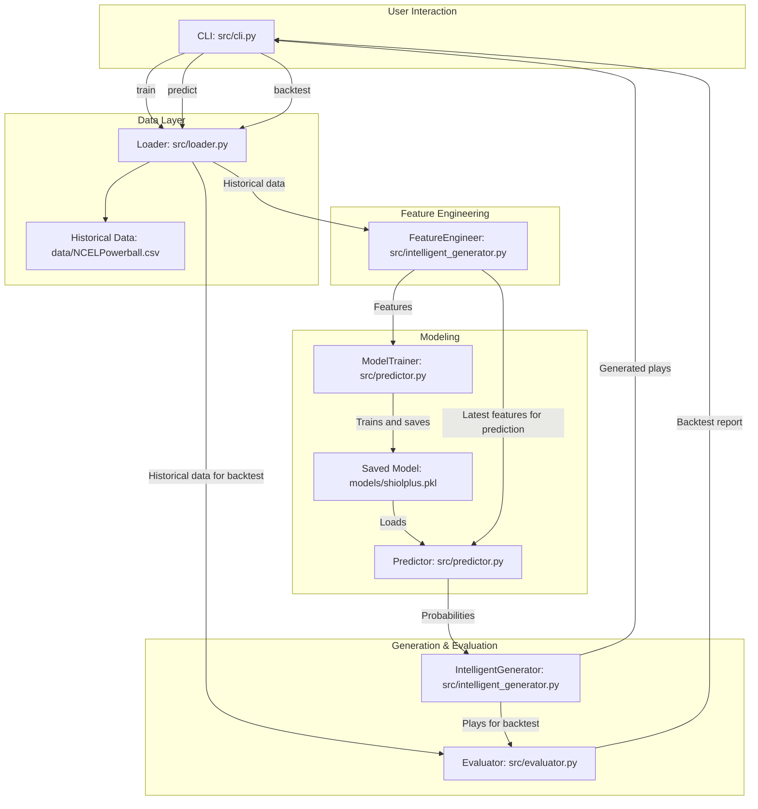

# SHIOL+ v2.0 - Technical Documentation for Developers

## 1. Introduction

SHIOL+ v2.0 is an AI-based lottery pattern analysis system. This version has been refactored to create an end-to-end pipeline focused on training a model, predicting number probabilities, and generating plays based on those predictions.

The system is designed modularly to facilitate maintenance and extension. The main interaction is through a command-line interface (CLI).

## 2. System Architecture

The architecture of SHIOL+ v2.0 follows a linear and logical data flow, where each component is responsible for a specific stage of the process.



### Data Flow

1.  **User Input**: The user initiates an action (`train`, `predict`, `backtest`) through `src/cli.py`.
2.  **Data Loading**: The `src/loader.py` loads historical data from `data/NCELPowerball.csv`, cleans it, and standardizes the columns.
3.  **Feature Engineering**: The `FeatureEngineer` class in `src/intelligent_generator.py` processes the historical data to create a set of statistical and temporal features (e.g., parity, sum, recency, trends).
4.  **Model Training (`train` command)**:
    *   The generated features are passed to `ModelTrainer` in `src/predictor.py`.
    *   An `XGBoost` model wrapped in a `MultiOutputClassifier` is trained to predict the probability of each number's appearance.
    *   The trained model is saved to `models/shiolplus.pkl`.
5.  **Prediction (`predict` and `backtest` commands)**:
    *   The `Predictor` in `src/predictor.py` loads the saved model.
    *   It uses the features from the most recent draws to predict the probabilities of each number (white balls and Powerball) for the next draw.
    *   These probabilities are passed to the `IntelligentGenerator`.
6.  **Play Generation**: The `IntelligentGenerator` class in `src/intelligent_generator.py` uses weighted sampling based on the model's probabilities to generate a specific number of unique plays.
7.  **Evaluation (`backtest` command)**:
    *   The generated plays are passed to the `Evaluator` in `src/evaluator.py`.
    *   The evaluator compares these plays against all historical draws to simulate performance and generate a results report (ROI, prize distribution, etc.).

## 3. Main Components Breakdown

### `src/cli.py`
*   **Purpose**: Main entry point and orchestrator of the application.
*   **Functionality**: Uses `argparse` to define the `train`, `predict`, `backtest`, and `update` commands. Each command calls the necessary classes and functions from other modules to execute the corresponding flow.

### `src/loader.py`
*   **`DataLoader`**: Class responsible for reading the local CSV file (`data/NCELPowerball.csv`). It uses `ColumnStandardizer` to ensure the data is in a consistent format for the rest of the system.
*   **`ColumnStandardizer`**: Standardizes column names (e.g., "Number 1" to "n1") and ensures the date column (`draw_date`) has the correct format.
*   **`update_powerball_data_from_csv()`**: Contains the logic to download the latest historical results from the NC Lottery website. This function is called by the `update` command from the CLI.
*   **`get_data_loader()`**: Factory function that reads `config/config.ini` to get the data file path and returns a `DataLoader` instance.

**Note on Data Updates**: The data update process is **not automatic**. To download the latest data, you must run the following command before training or making predictions:
```bash
python src/cli.py update
```

### `src/intelligent_generator.py`
This file contains two key classes:
*   **`FeatureEngineer`**:
    *   **Purpose**: To create the dataset that the model will use for learning.
    *   **Features Created**:
        *   **Basic**: `even_count`, `odd_count`, `sum`, `spread`, `consecutive_count`.
        *   **Temporal**: Recency (`avg_delay`), temporal weighting (`time_weight`), trends (`increasing_trend_count`), and seasonal patterns.
        *   **Geometric**: Euclidean distance between number combinations.
*   **`IntelligentGenerator`**:
    *   **Purpose**: To generate final plays.
    *   **How it works**: It receives the probabilities for the white balls and Powerball from the `Predictor`. It uses `np.random.choice` with these probabilities as weights to generate plays, ensuring no repeated numbers within a single play and that the generated plays are unique.

### `src/predictor.py`
*   **`ModelTrainer`**:
    *   **Purpose**: To handle the Machine Learning model's lifecycle.
    *   **How it works**:
        1.  **`create_target_variable`**: Transforms the problem into a multi-label classification. It creates a `y` DataFrame where each column represents a possible number (e.g., `wb_1`...`wb_69`, `pb_1`...`pb_26`) and the value is 1 if that number appeared in the draw, and 0 otherwise.
        2.  **`train`**: Trains an `XGBClassifier` within a `MultiOutputClassifier`, allowing a single base model to work for all output labels.
        3.  **`evaluate_model`**: Calculates the `roc_auc_score` and `log_loss` to measure the model's performance on the test set.
        4.  **`save_model` / `load_model`**: Saves and loads the trained model object along with the target column names using `joblib`.
*   **`Predictor`**:
    *   **Purpose**: To orchestrate the prediction process.
    *   **How it works**: It loads the trained model, gets the latest historical data, passes it through the `FeatureEngineer` to get the last row's features, and uses the `ModelTrainer` to predict probabilities.

### `src/evaluator.py`
*   **`Evaluator`**:
    *   **Purpose**: To evaluate the performance of a gaming strategy.
    *   **`run_backtest`**: Iterates over each draw in the historical data. For each one, it evaluates the generated plays to see how many matches they had and what prize they would have won.
    *   **Metrics**: Calculates the total cost, total winnings, Return on Investment (ROI), and a distribution of the prizes won.

## 4. Configuration File (`config/config.ini`)

This file centralizes the system's parameters.

*   **`[paths]`**: Paths to the data, model, and log files.
*   **`[model_params]`**: Hyperparameters for model training, such as the test set size (`test_size`) and the number of estimators (`n_estimators`).
*   **`[temporal_analysis]`**: Parameters used by `FeatureEngineer` for temporal analysis, such as the decay function (`time_decay_function`) and moving window size (`moving_window_size`).

## 5. External Dependencies (`requirements.txt`)

*   **`pandas`**: For data manipulation and analysis in DataFrames.
*   **`numpy`**: For efficient numerical operations, especially in play generation.
*   **`scikit-learn`**: Used for splitting data (`train_test_split`) and for the `MultiOutputClassifier`.
*   **`xgboost`**: The gradient boosting model used as the base classifier.
*   **`joblib`**: For serializing (saving) and deserializing (loading) the Python model.
*   **`loguru`**: For simple and powerful logging.
*   **`statsmodels`**: Used in `FeatureEngineer` to detect seasonal patterns (autocorrelation calculation).
*   **`requests`**: Used by the `update` command to download the latest lottery data from the NC Lottery website.

## 6. How to Extend the System

The modular architecture allows for extending the system with relative ease.

### Adding a New Feature

1.  Open `src/intelligent_generator.py`.
2.  Inside the `FeatureEngineer` class, add a new private method (e.g., `_calculate_my_new_feature`).
3.  Call this new method from `engineer_features`.
4.  Ensure the new feature column is added to the `feature_cols` list in the `_get_feature_matrix` method of `ModelTrainer` in `src/predictor.py`.
5.  Retrain the model with `python src/cli.py train` for the new feature to be used.

### Adding a New Command to the CLI

1.  Open `src/cli.py`.
2.  In the `main` function, add a new `subparser` using `subparsers.add_parser('my_command', ...)`.
3.  Create a new function to handle the command (e.g., `def my_command_handler(args):`).
4.  Set the handler function with `parser_new_command.set_defaults(func=my_command_handler)`.
5.  Implement the logic for your new command, calling the necessary modules.